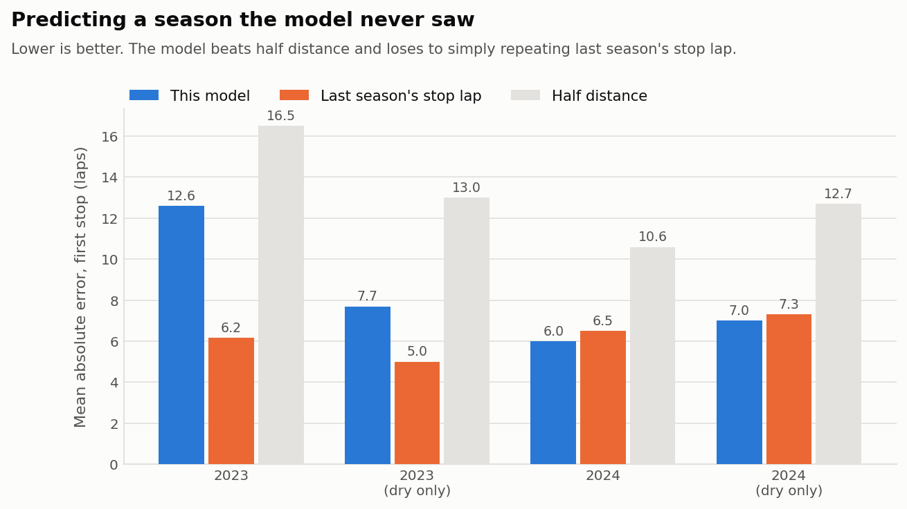
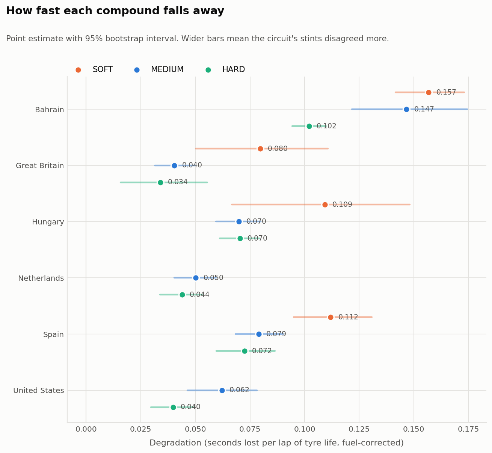
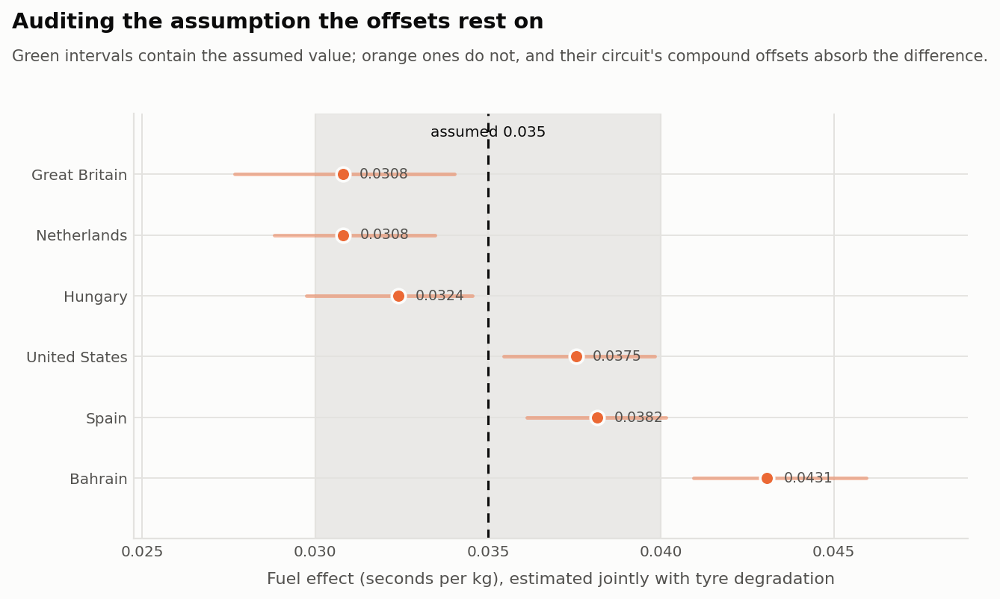

# When should a Formula 1 car pit?

Estimating tyre degradation from public race data, turning it into a stop-lap
recommendation, and then testing that recommendation on seasons the model has
never seen.

The interesting question is not "how fast does a tyre degrade" — it is **how much
of the answer survives the assumptions you had to make to get it.** So alongside
the headline number this ships a cleaning audit, two-level bootstrap intervals,
an identifiability diagnostic that says when a result is not supported by the
data at all, three sensitivity sweeps, and a walk-forward backtest scored against
the baselines it actually has to beat.

Two of those checks reject parts of this model. Both are reported below.

```bash
pip install -r requirements.txt
python run.py demo             # simulated races, no network needed — start here
python run.py all              # fetch 18 races (3 seasons x 6 circuits), then run
python sensitivity.py          # do the fuel assumptions drive the answer?
python sensitivity.py --caps   # does the stint-length cap drive it?
pytest                         # 37 tests, mostly recovering known truth
```

---

## The method, and why each step is there

**1. Identify races exactly, never fuzzily.**
`fastf1.get_session(2024, "Great Britain", "R")` returns the **Austrian** Grand
Prix. It fuzzy-matches, mentions the substitution at INFO level, and hands back a
valid session for a different circuit with a different tyre allocation and 71
laps instead of 52. Nothing downstream errors; every table fills in; the whole
study describes Spielberg while its axis labels say Silverstone.

Circuits are pinned to exact official event names, the round is resolved from the
schedule by exact match insisting on exactly one hit, and the event that comes
back is verified again before a single lap is used. Round numbers can't be
hard-coded either — the British Grand Prix was round 10 in 2022 and round 12 in
2024.

**2. Keep only laps that measure the tyre.**
Drop safety-car, VSC and yellow-flag laps (FastF1 concatenates status codes, so
only `"1"` is green throughout); in-laps and out-laps; stint warm-up laps; wet
compounds; laps FastF1 flags inaccurate. Within each stint, reject laps beyond 3
robust standard deviations of the stint median using **median absolute
deviation** — one lap behind a backmarker can be four seconds slow, and a
mean-based threshold is wide enough to keep the very outlier it should reject.

Every step is counted in `outputs/cleaning_audit.csv`, which is how the warm-up
filter was caught doing nothing: tyre life 1 is the out-lap, already removed, so
`TyreLife > stint_warmup_laps` never dropped the warm-up lap it was named for.
Documented, swept in the sensitivity analysis, and inert.

**3. Estimate fuel, degradation and compound pace together — not one after another.**
The step the project turns on.

The conventional approach subtracts an assumed fuel effect and reads tyre
behaviour from what is left. But compound choice and fuel load are nearly the
same variable: teams run softs early on a heavy car and hards late on a light
one. At Bahrain 2024 hards appear *only* in stints 2–3 and softs *only* in
stints 1, 3 and 4. Any error in the assumed coefficient therefore doesn't average
out — it lands on whichever compound was running and is reported as a tyre
property.

So one robust regression per circuit:

```
lap time = driver-season baseline
         + compound offset
         + compound degradation × tyre age
         + fuel coefficient × fraction of tank remaining
```

with the fuel coefficient **estimated, not assumed**. Fuel enters as a fraction
of the starting tank rather than in kilograms, because the starting mass isn't
public and a seconds-per-kg coefficient can't be estimated without assuming the
unknown number. Baselines are per driver *and season* — the same name in 2022 and
2024 is a different car, and pooling those would push aero-regulation changes
into the compound terms.

Identification comes from *across* stints. Within one stint, tyre age and fuel
load are perfectly collinear — the tyre ages exactly as the tank empties — so a
single stint says nothing about fuel. The same driver starting stint 2 on a fresh
tyre with a much lighter car is what separates them.

**4. Say so when the data cannot answer.**
Where a circuit ran each compound in only one race phase, "soft tyre" and "heavy
car" are the same column of the design matrix. The regression still returns a
number; that number is meaningless. `identifiability_report` measures the overlap
between each compound's fuel-load range and the reference compound's, as a
Jaccard index on interquartile ranges, and refuses to vouch for offsets below a
threshold.

**5. Pool three seasons, and check that's allowed.**
One season cannot measure compound pace — on 2024 alone, five of six circuits
failed the identifiability test. Different years bring different strategies to
the same track, and that variation is what finally separates compound from fuel.

The cost is that "SOFT" is a label, not a rubber: Pirelli allocates C1–C5 per
event and the mapping moves between years. `season_heterogeneity` estimates each
season separately and flags cells whose bootstrap intervals are disjoint, so
pooled figures covering compounds that don't behave alike are visible rather than
averaged away.

**6. Fit slopes robustly, with intervals that aren't lies.**
Per-stint **Theil–Sen** (≈29% breakdown point, against zero for OLS), pooled by
stint length, with a **two-level bootstrap**: whole stints resampled for
between-stint disagreement, *and* each resampled slope perturbed by its own
standard error. The second level wasn't planned — the first version's intervals
were tight enough that a known-correct synthetic value fell outside them.

**7. Refuse to optimise on evidence that isn't there.**
A cell needs 3 stints, 30 laps, a finite interval and a non-negative slope.
Hungary 2024's single 12-lap soft stint fitted **−0.108 s/lap** — a tyre getting
faster with age — and drove a recommendation of 65 of 70 laps on one set of
softs, beating any two-stop by a claimed 49 seconds. Exclusions are reported with
reasons.

**8. Measure the cliff, then make it earn its place.**
`late_stint_penalty` fits a line to the first two-thirds of each long stint and
measures how much more the final third loses. `fit_stint_curvature` turns that
into a quadratic term the strategy model can price, with the closed form
`offset·n + deg·n(n+1)/2 + curve·n(n+1)(2n+1)/6`. Whether it's *used* is decided
in the findings below, by the backtest, not by whether the story is appealing.

**9. Pit loss from the data, not a lookup table.**
`(in-lap + out-lap) − 2 × the driver's own nearby green-flag pace`, median across
stops. Safety-car stops excluded: stopping under a safety car is cheap, and
including them would understate the cost of the green-flag stop being decided.

**10. Optimise with limits, and show what the limits did.**
Every one- and two-stop plan, subject to the two-compound rule and a cap on stint
length from the longest stint the field completed. Without the cap, linear
degradation extrapolates forever and the optimiser plans stints no tyre survives.

The cap is the least principled input here — revealed preference, not physics,
and partly circular: if the field two-stopped, no long stint was observed, so a
long stint looks impossible, so the model must two-stop too. The uncapped answer
is reported alongside every capped one and `sensitivity.py --caps` sweeps it.

**11. Predict a season you have never seen.**
Everything above is in-sample or synthetic. `src/backtest.py` walks forward —
2022 predicts 2023, then 2022–23 predict 2024 — refitting from scratch each time.
Nothing from the held-out season reaches the tyre model. Only the scheduled lap
count and the pit-lane loss are supplied, because both are known before the
lights go out.

---

## Findings

18 races: Bahrain, Spain, Great Britain, Hungary, Netherlands, United States,
across 2022–2024. 21,124 raw laps, 15,710 surviving cleaning (74%).

### The fuel coefficient is not the quoted constant, and it varies by circuit

Estimated jointly with tyre behaviour, against an assumed 0.035 s/kg:

| Circuit | Estimated s/kg | 95% CI | Contains 0.035? |
|---|---|---|---|
| Bahrain | 0.0431 | 0.0409–0.0459 | **no** |
| Spain | 0.0382 | 0.0361–0.0401 | **no** |
| United States | 0.0375 | 0.0355–0.0398 | yes |
| Hungary | 0.0324 | 0.0297–0.0346 | yes |
| Netherlands | 0.0308 | 0.0288–0.0335 | yes |
| Great Britain | 0.0308 | 0.0277–0.0340 | yes |

Two circuits reject the assumed value outright, and the spread across circuits
(0.031 to 0.043) is larger than the range usually quoted for the constant itself.

**What this buys.** Sweeping the fuel constants (90–110 kg, 0.030–0.040 s/kg),
the recommended stop lap moves **0–1 laps** using the joint model's offsets,
against **up to 9 laps** using assumed-fuel offsets on the same data. The
sensitivity was never really about degradation — a fuel error is common-mode
across compounds and cancels in the comparison that sets the stop lap. It entered
through the offsets, and estimating the coefficient removes it.

### Pooling seasons is what makes compound offsets estimable

| | 2024 only | 2022–2024 |
|---|---|---|
| Circuits with identified offsets | **1 of 6** | **3 of 6** |

Bahrain (overlap 0.43), Hungary (0.55) and Spain (0.41) now pass. Great Britain
(0.03), Netherlands (0.00) and United States (0.00) still fail — at those tracks
every compound ran in essentially one race phase in all three years. Their
numbers are still written to disk, flagged, and carried into the strategy summary
as `OffsetsIdentified=False`, because a recommendation resting on an unidentified
input should say so on its face.

This was the single highest-value change in the project, and it is the direct
answer to the previous version's main negative result.

### Degradation, which the data does support

Seconds lost per lap of tyre life, pooled across three seasons:

| Circuit | HARD | MEDIUM | SOFT |
|---|---|---|---|
| Bahrain | 0.102 | 0.147 | 0.157 |
| Spain | 0.073 | 0.079 | 0.112 |
| Hungary | 0.070 | 0.070 | 0.109 |
| United States | 0.040 | 0.062 | *excluded* |
| Netherlands | 0.044 | 0.050 | *excluded* |
| Great Britain | 0.034 | 0.040 | 0.080 |

Soft > medium > hard holds everywhere it is measured. Three seasons gives full
compound coverage where one gave gaps, and the intervals are roughly half as
wide. Two cells are excluded by the evidence guards: Netherlands SOFT fits a
negative slope, United States SOFT has one stint.

Nine cells are flagged by `season_heterogeneity` as disagreeing between seasons —
Netherlands SOFT spans −0.169 to +0.095 s/lap across 2022–24. That is the
label-versus-rubber problem showing up exactly where it should.

Pit loss remains the most solid output: 20–25 s per circuit, IQR under 2.2 s
except at wet-affected races, ordered as pit-lane geometry says it should be.

### Out-of-sample: the model is worth roughly one season of history

Mean absolute error on the field's median first stop, for a season the model
never saw:

| Train | Test | Model | Last season's stop lap | Half distance | Stop count |
|---|---|---|---|---|---|
| 2022 | 2023 | 12.6 | **6.2** | 16.5 | 67% |
| 2022–23 | 2024 | **6.0** | 6.5 | 10.6 | 67% |
| 2022 | 2023 *(dry only)* | 7.7 | **5.0** | 13.0 | 80% |
| 2022–23 | 2024 *(dry only)* | **7.0** | 7.3 | 12.7 | 80% |

Read this carefully, because it is the most honest table in the repository.

The model beats half distance everywhere — but half distance is a straw man. The
baseline that matters is persistence: *stop where this circuit was stopped at
last time*, which is free and is what any engineer would reach for first. Against
that, **the model loses with one season of training and wins narrowly with two.**
A margin of 0.3–0.5 laps is not a victory anyone should lean on; the fair summary
is that three seasons of modelling is worth about as much as remembering last
year, and the trend with more data is the encouraging part.

Stop *count* is where it does better: **80% correct on dry races.** That is a
genuinely useful call and a harder one than it looks.

Two races are excluded from the dry-only rows, detected from the tyres the field
actually fitted rather than from a weather feed. Across 18 races the wet-lap share
is either 0.0% or 24.4% with nothing in between, so the 5% threshold sits in an
empty gap and cannot be tuned to flatter anything. Both sets of numbers are
reported regardless.

### The curvature term is real, and it does not work

Seven circuit/compound cells show statistically clear positive curvature —
Hungary SOFT at +0.0166 s/lap², CI [0.0087, 0.0268]. `late_stint_penalty` finds
accelerating wear independently at four circuits. The theory is sound: pricing a
stint linearly claims a tyre's twentieth lap costs what its second did, and
under-charging long stints is exactly what makes an optimiser stop too late.

It still makes held-out predictions **worse**:

| Test | Without curvature | With curvature |
|---|---|---|
| 2024 | **6.0** | 8.0 |
| 2024 (dry only) | **7.0** | 9.4 |

So it is measured, reported, and switched off — `Assumptions.apply_curvature`
carries the reasoning. A second derivative taken from twenty noisy laps is fitted
to the tail of each stint, and the tail is where traffic and fuel-saving live, so
it appears to be learning the end of a stint rather than the tyre.

Keeping it on would have made the write-up more satisfying and the model worse.

### The remaining bias, and what it isn't

The model still stops late — bias +5.7 laps on 2024, +7.0 on dry races. **Track
position does not explain it.** Crediting each stop with an undercut leaves the
stop lap completely unchanged, and that is structural rather than a null result:
a flat per-stop credit subtracts the same constant from every one-stop plan, so
it can only move the one-versus-two-stop decision. Explaining the late bias needs
a term whose value depends on *when* the stop happens, and this study has no data
to calibrate one.

### The honest summary

Degradation rates, pit loss and the fuel coefficient are solid and now rest on
three seasons. Compound offsets are estimable at three circuits of six and are
flagged at the rest. Stop count is called correctly 80% of the time on dry races.
The stop lap is worth about as much as remembering what happened last year.

### Figures

<picture>
  <source media="(prefers-color-scheme: dark)" srcset="outputs/backtest-vs-baseline-dark.png">
  
</picture>

<picture>
  <source media="(prefers-color-scheme: dark)" srcset="outputs/degradation-by-circuit-dark.png">
  
</picture>

<picture>
  <source media="(prefers-color-scheme: dark)" srcset="outputs/fuel-effect-estimated-dark.png">
  
</picture>

Charts render for both GitHub themes. The compound colours are deliberately not
the sidewall colours: red against yellow is one of the hardest pairs for red–green
colour blindness, and white or grey carries no chroma on a pale background. These
hues were checked for colour-vision separation and contrast, and every value is
directly labelled, so colour is never the only way to read a chart.

---

## How this is tested

37 tests, built on one principle: **a test that shares an assumption with the code
it tests proves nothing.**

The original synthetic race was generated with exactly the fuel coefficient the
pipeline assumes, making the correction perfect by construction. Every test
passed, and none could have detected a wrong fuel coefficient — the failure that
was corrupting the real analysis. `fuel_effect` and `strategy_mix` are now free
parameters, and the suite includes:

- `test_joint_model_survives_fuel_misspecification_and_the_naive_path_does_not` —
  with truth at 0.050 and the pipeline assuming 0.035, the joint model recovers
  every rate to within 0.012 s/lap while the naive path returns **−0.006 s/lap
  for the hard tyre**. The Hungary pathology, reproduced from known inputs.
- `test_backtest_never_fits_on_the_season_it_predicts` — the leakage guard.
  Without it, out-of-sample validation is theatre.
- `test_identifiability_flags_a_confounded_design` — a race where every soft lap
  is heavy must be refused, not answered.
- `test_curvature_falls_back_to_zero_on_a_straight_line` — inventing a cliff is
  worse than missing one.
- `test_curvature_shortens_the_longest_stint` — and deliberately does *not* claim
  curvature moves the stop earlier, because it doesn't; it balances stint lengths.
- `test_warmup_assumption_actually_removes_warmup_laps` — an assumption nothing
  depends on is worse than no assumption; it looks like rigour.

---

## What this model does not know

- **Traffic.** Track position is worth real lap time and the model has no concept
  of the car in front. Still the largest single omission.
- **The undercut.** Modelled only as a flat per-stop credit, which is provably
  unable to move a stop lap. Doing better needs rival-relative modelling.
- **Safety cars.** A stop under one is roughly half price. Real strategy is a
  decision under uncertainty about when one appears; this is deterministic.
- **Tyre allocation.** Teams have a finite set, partly used in practice and
  qualifying. The model assumes any compound is always available new.
- **Track evolution.** The circuit rubbers in through a race; not separated from
  degradation here, and it biases slopes slightly downward.
- **Compound identity across seasons.** "SOFT" is a label; the C-number moves
  between years. Flagged per cell, not solved.
- **Non-linear degradation.** Measured, priced, backtested, and rejected. The
  right fix is probably a tyre-age model with a cliff *threshold* rather than a
  smooth quadratic — a cliff is not a parabola.

Most valuable next steps: model the cliff as a threshold rather than a quadratic
and re-run the backtest; extend to every circuit on the calendar so persistence
has more to beat; add safety-car probability and optimise in expectation.

---

## Repository layout

```
run.py                 pipeline entry point: fetch / analyse / all / demo
sensitivity.py         assumption sweeps: fuel, undercut, stint caps
src/config.py          every assumption, in one place, with justification
src/data.py            FastF1 loading -> tidy lap table, with event verification
src/clean.py           lap filtering and fuel correction
src/model.py           joint model, pooling, identifiability, curvature, pit loss
src/strategy.py        race-time model and plan optimisation
src/backtest.py        walk-forward out-of-sample validation
src/plots.py           figures, light and dark
src/synthetic.py       simulated races with known ground truth
tests/                 37 tests, mostly "does it recover the truth"
```

## Data

Timing data comes from the Formula 1 live timing API via
[FastF1](https://github.com/theOehrly/Fast-F1), cached locally on first fetch.
This project is unofficial and not associated with Formula 1, the FIA, or any team.
