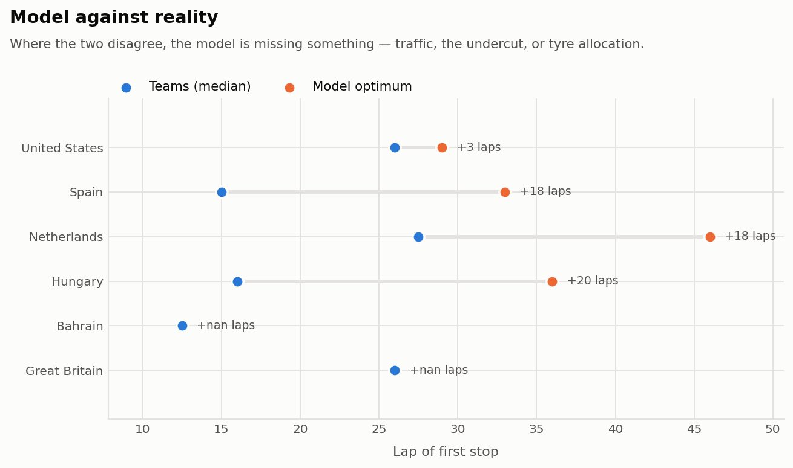

# When should a Formula 1 car pit?

Estimating tyre degradation from public race data, and turning it into a stop-lap
recommendation that can be checked against what the teams actually did.

The interesting question is not "how fast does a tyre degrade" — it is **how much
of the answer survives the assumptions you had to make to get it.** This
repository is built around that question. Alongside the headline number it ships
a cleaning audit, confidence intervals from a two-level bootstrap, a linearity
check, an identifiability diagnostic that says when a result is not supported by
the data at all, and three sensitivity sweeps.

```bash
pip install -r requirements.txt
python run.py demo             # simulated races, no network needed — start here
python run.py all              # fetch six 2024 races, then run the full study
python sensitivity.py          # how much do the fuel assumptions drive the answer?
python sensitivity.py --caps   # how much does the stint-length cap drive it?
pytest                         # 27 tests, mostly recovering known truth from simulated data
```

---

## The method, and why each step is there

**1. Identify races by round number, never by name.**
`fastf1.get_session(2024, "Great Britain", "R")` returns the **Austrian** Grand
Prix. It fuzzy-matches, mentions the substitution at INFO level, and hands back a
perfectly valid session for a different circuit with a different tyre allocation
and 71 laps instead of 52. Nothing downstream errors; every table fills in; the
entire study describes Spielberg while its axis labels say Silverstone.

Races are therefore pinned to round numbers, and `data.load_race` asserts the
returned `EventName` matches what was expected before a single lap is used. Both
the study's label and the API's own event name are carried in the lap table, so
the two can be compared long after the run.

**2. Keep only laps that measure the tyre.**
A raw race lap time is tyre condition plus fuel load plus traffic plus track
status plus driver effort. The pipeline drops everything it can identify as not
being degradation: laps under safety car, VSC or yellow flags (FastF1
concatenates track-status codes per lap, so only `"1"` is green throughout);
in-laps and out-laps; the warm-up lap of each stint; wet compounds; and laps
FastF1 itself flags inaccurate. Within each stint, laps more than 3 robust
standard deviations from the stint median are rejected using **median absolute
deviation** rather than standard deviation — one lap stuck behind a backmarker
can be four seconds slow, and a mean-based threshold is wide enough to keep the
very outlier it should reject.

Every step is counted in `outputs/cleaning_audit.csv`, which is how the warm-up
filter was caught doing nothing: tyre life 1 is the out-lap, already removed, so
`TyreLife > stint_warmup_laps` never dropped the warm-up lap it was named for.
The assumption was documented, swept in the sensitivity analysis, and inert.

**3. Estimate fuel, degradation and compound pace together — not one after another.**
This is the step the project turns on.

The conventional approach subtracts an assumed fuel effect from every lap and
reads tyre behaviour out of what is left. The problem is that compound choice and
fuel load are nearly the same variable: teams run softs early on a heavy car and
hards late on a light one. At Bahrain 2024, hards appear *only* in stints 2 and 3
and softs *only* in stints 1, 3 and 4:

```
Bahrain  stint:  1    2    3    4          Spain  stint:  1    2    3    4
HARD            0  412  379    0           HARD            0    0  360    0
SOFT          233    0   62   43           SOFT          288   60  125   38
```

Any error in the assumed fuel coefficient therefore does not average out. It
lands on whichever compound was running at that point in the race and is reported
as a tyre property. So the study fits one robust regression per circuit,

```
lap time = driver baseline
         + compound offset
         + compound degradation × tyre age
         + fuel coefficient × fraction of tank remaining
```

with the fuel coefficient **estimated rather than assumed**. Driver dummies
absorb car pace so compounds are compared within a driver. Fuel is expressed as a
fraction of the starting tank, not in kilograms, because the starting mass is not
public and a coefficient in seconds-per-kg cannot be estimated without assuming
the very number that is unknown.

Identification comes from *across* stints. Within one stint, tyre age and fuel
load are perfectly collinear — the tyre ages exactly as the tank empties — so a
single stint says nothing about fuel. The same driver starting stint 2 on a fresh
tyre with a much lighter car is what separates the two effects.

**4. Say so when the data cannot answer.**
Where a circuit ran each compound in only one race phase, "soft tyre" and "heavy
car" are the same column of the design matrix and no estimator can separate them.
The regression still returns a number; that number is meaningless.
`model.identifiability_report` measures the overlap between each compound's
fuel-load range and the reference compound's, as a Jaccard index on interquartile
ranges, and refuses to vouch for offsets below a threshold. **On the six 2024
races, five circuits fail this test.** Reporting that is the single most useful
thing the study does.

**5. Fit a slope per stint, robustly.**
Each stint also gets a **Theil–Sen** regression of fuel-corrected lap time on
tyre age. Theil–Sen takes the median of the pairwise slopes, giving it a ~29%
breakdown point: up to roughly a third of a stint's laps can be corrupted by
traffic before the estimate is pulled off course. Ordinary least squares has a
breakdown point of zero — a single bad lap moves the answer. This stays the
authoritative estimate for degradation, where robustness matters more than the
joint model's efficiency, and the two are cross-checked against each other.

**6. Pool stints with an interval that is not a lie.**
Stint slopes are pooled per circuit and compound, weighted by stint length, with
a **two-level bootstrap**: whole stints are resampled to capture disagreement
between drivers and cars, *and* each resampled slope is perturbed by its own
standard error to capture the fact that it is itself an estimate from ~20 noisy
laps.

The second level was not planned. The first version modelled only between-stint
variation, and on synthetic data with a known answer the true value fell outside
the 95% interval — the interval was too confident.

**7. Refuse to optimise on evidence that isn't there.**
A circuit/compound cell needs at least 3 stints and 30 laps, a finite interval,
and a non-negative slope before it reaches the optimiser. Hungary 2024 ran exactly
one 12-lap soft stint which fitted a slope of **−0.108 s/lap** — a tyre getting
faster with age. Fed that, the optimiser recommended 65 of 70 laps on a single set
of softs, with a one-lap window, and claimed it beat any two-stop by 49 seconds.
Excluded cells are reported with their reason rather than dropped silently.

**8. Check the straight line is allowed.**
Every stint is fitted both linearly and quadratically and scored by leave-one-out
cross-validated RMSE. Separately, `late_stint_penalty` fits a line to the first
two-thirds of each long stint and measures how much more time the final third
loses than that line predicts — a direct test of whether degradation accelerates.

**9. Measure the pit loss from the data, not from a lookup table.**
`(in-lap + out-lap) − 2 × the driver's own nearby green-flag pace`, taken as a
median across stops. Safety-car stops are excluded: stopping under a safety car
is cheap, and including those would understate the cost of the green-flag stop
the strategy model is actually deciding about.

**10. Turn it into a decision, with limits.**
A stint of `n` laps costs `offset × n + deg × n(n+1)/2`, plus pit loss per stop.
Every one-stop and two-stop plan is enumerated subject to the two-compound rule
and to a cap on stint length taken from the longest stint the field actually
completed. Without that cap, linear degradation extrapolates indefinitely and the
optimiser will happily plan a stint no tyre survives.

The cap is the least principled input in the study — it encodes revealed
preference, not physics, and the reasoning is partly circular: if the field
two-stopped, no long stint was observed, so a long stint looks impossible, so the
model must two-stop too. The uncapped answer is therefore reported alongside
every capped one, and `sensitivity.py --caps` sweeps the margin.

**11. Check it against reality.**
The recommendation is compared with the median green-flag first-stop lap the
teams actually chose. Where the two disagree, the disagreement is the finding.

---

## Findings

Six 2024 races: Bahrain, Spain, Great Britain, Hungary, Netherlands, United
States. 7,239 raw laps, 5,682 surviving cleaning (78%).

### The fuel coefficient is not what the literature quotes, and it varies

Estimated jointly with tyre behaviour, against an assumed 0.035 s/kg:

| Circuit | Estimated s/kg | 95% CI | Contains 0.035? |
|---|---|---|---|
| Spain | 0.0417 | 0.0389–0.0444 | **no** |
| Bahrain | 0.0409 | 0.0383–0.0441 | **no** |
| United States | 0.0409 | 0.0367–0.0465 | yes |
| Great Britain | 0.0346 | 0.0322–0.0448 | yes |
| Hungary | 0.0325 | 0.0277–0.0361 | yes |
| Netherlands | 0.0292 | 0.0251–0.0391 | yes |

Two circuits reject the assumed value outright. That matters because every
compound offset in a conventional pipeline is a residual left after the fuel
effect is removed — so at Bahrain and Barcelona, the assumed coefficient was
doing the talking.

**What this buys.** Sweeping the fuel constants (90–110 kg, 0.030–0.040 s/kg),
the recommended stop lap moves by **0–1 laps** using the joint model's offsets,
against **up to 9 laps** using assumed-fuel offsets on the same data. The
sensitivity was never really about degradation — the fuel error is common-mode
across compounds and cancels in the comparison that sets the stop lap. It was
entering through the offsets, and estimating the coefficient removes it.

### Five of six circuits cannot support a compound offset at all

| Circuit | Min fuel overlap | Offsets identified |
|---|---|---|
| Bahrain | 0.53 | **yes** |
| Spain | 0.14 | no |
| United States | 0.09 | no |
| Great Britain | 0.00 | no |
| Hungary | 0.00 | no |
| Netherlands | 0.00 | no |

At the five failing circuits every compound was run in essentially one phase of
the race, so its pace difference is inseparable from fuel load. The numbers are
still written to `outputs/compound_offsets_joint.csv`, flagged, and carried into
the strategy summary as `OffsetsIdentified=False` — because a recommendation
resting on an unidentified input should say so on its face.

At Bahrain, the one circuit that passes, the joint model puts soft-versus-hard
new-tyre pace at **+0.018 s [−0.267, +0.317]** — indistinguishable from zero. The
naive method reports +0.166 s with no interval and no warning.

**This is the study's main negative result, and it generalises:** a single race
rarely contains the design needed to measure compound pace. Fixing it needs
multiple races per circuit, not better statistics.

### Degradation, which the data does support

| Circuit | HARD | MEDIUM | SOFT |
|---|---|---|---|
| Bahrain | 0.100 | — | 0.122 |
| Hungary | 0.080 | 0.074 | *excluded* |
| Spain | 0.071 | 0.073 | 0.094 |
| Great Britain | 0.053 | 0.067 | 0.154 |
| Netherlands | 0.049 | 0.053 | 0.073 |
| United States | 0.021 | 0.034 | — |

Seconds lost per lap of tyre life. A 4.8× spread between Bahrain and Austin on
hards, with tight intervals on the well-covered cells. The soft > medium > hard
ordering holds wherever both are measured except Hungary, where the two are
within each other's intervals.

Pit loss is the most solid output in the project: 20.4–25.4 s, IQR under 2.2 s
everywhere except Silverstone, estimated from 21–45 stops per circuit, ordered as
the pit-lane geometry says it should be. Silverstone's wider IQR (4.4 s) is the
wet race showing through.

### The model agrees with teams on stop count, and stops too late

| Circuit | Model | Teams | Stop lap (model / teams) |
|---|---|---|---|
| Bahrain | 2 stops | 2 stops | one-stop infeasible |
| Great Britain | 2 stops | 2 stops | one-stop infeasible |
| Hungary | 2 stops | 2 stops | 36 / 16 |
| Spain | 2 stops | 2 stops | 33 / 15 |
| United States | 1 stop | 1 stop | 29 / 26 |
| Netherlands | 2 stops | 1 stop | 46 / 27.5 |

**Five of six agree on stop count.** At Bahrain and Silverstone no pair of stints
covers the distance within observed tyre limits, so the model calls the race
un-one-stoppable — which is what the field concluded too. Bahrain is decided by a
single lap, though: the longest hard stint run was 29 laps and the longest soft
21, giving 56 against a 57-lap race, and `--caps` shows the call flips at a
margin of 5 laps. That recommendation rests on the cap, not on the tyre data.

The stop *lap* is another matter: where a one-stop is feasible the model is 3 to
20 laps late, every time. **Track position does not explain it.** Crediting each
stop with an undercut leaves the stop lap completely unchanged, and that is
structural rather than a null result — a flat per-stop credit subtracts the same
constant from every one-stop plan, so it can only move the one-versus-two-stop
decision. Explaining the late bias needs a term whose value depends on *when* the
stop happens, and this study has no data to calibrate one.

What the data does support is that the tyre model itself is too kind to old
rubber:

| Circuit | Extra loss in final third | Stints accelerating |
|---|---|---|
| Great Britain | +0.430 s/lap | 82% |
| Hungary | +0.153 s/lap | 64% |
| Bahrain | +0.149 s/lap | 76% |
| United States | +0.084 s/lap | 67% |
| Spain | +0.022 s/lap | 52% |
| Netherlands | −0.098 s/lap | 33% |

Five of six circuits lose more late in a stint than a straight line predicts, so
`deg × n(n+1)/2` under-charges long stints and the optimiser stops too late — the
right direction and roughly the right places. Netherlands is the one circuit
where wear does *not* accelerate, and it is also the one circuit where the model
gets the stop count wrong. Consistent with the quadratic winning 53% of hard-tyre
stints on leave-one-out RMSE, against 43% overall.

### The honest summary

The data supports a **stop window and a stop count**, not a stop lap. Degradation
rates and pit loss are solid. Compound offsets are not identified at five of six
circuits and should not be quoted. The recommended stop lap is systematically
late for a reason the study can name but not yet fix.

### Figures

<picture>
  <source media="(prefers-color-scheme: dark)" srcset="outputs/degradation-by-circuit-dark.png">
  
</picture>

<picture>
  <source media="(prefers-color-scheme: dark)" srcset="outputs/fuel-effect-estimated-dark.png">
  
</picture>

<picture>
  <source media="(prefers-color-scheme: dark)" srcset="outputs/model-vs-actual-dark.png">
  
</picture>

Charts are rendered for both GitHub themes. The compound colours are deliberately
not the sidewall colours: red against yellow is one of the hardest pairs for
red–green colour blindness, and white or grey carries no chroma on a pale
background. The three hues used here were checked for colour-vision separation
and contrast, and every value is also directly labelled, so colour is never the
only way to read the chart.

---

## How this is tested

27 tests, and the design principle behind them is worth stating: **a test that
shares an assumption with the code it tests proves nothing.**

The original synthetic race was generated with exactly the fuel coefficient the
pipeline assumes, which made the fuel correction perfect by construction. Every
test passed. No test could have detected a wrong fuel coefficient — the failure
mode that turned out to be corrupting the real analysis. The generator now takes
`fuel_effect` as a free parameter, and the suite includes:

- `test_joint_model_survives_fuel_misspecification_and_the_naive_path_does_not` —
  with truth at 0.050 and the pipeline assuming 0.035, the joint model recovers
  every degradation rate to within 0.012 s/lap while the naive path returns
  **−0.006 s/lap for the hard tyre**. That is the Hungary pathology, reproduced
  on demand from known inputs.
- `test_identifiability_flags_a_confounded_design` — a simulated race where every
  soft lap is heavy and every hard lap is light must be refused, not answered.
- `test_warmup_assumption_actually_removes_warmup_laps` — an assumption nothing
  depends on is worse than no assumption; it looks like rigour.
- `test_race_config_is_unambiguous` — every race pinned to a round number.
- `test_late_stint_penalty_detects_a_cliff_and_ignores_a_straight_line` — the
  diagnostic has to be quiet on linear wear, or it detects nothing.

---

## What this model does not know

Stated plainly, because a model presented without its limits is being oversold:

- **Traffic.** Track position is worth real lap time and the model has no concept
  of the car in front. Still the largest single omission.
- **The undercut.** Modelled only as a flat per-stop credit, which is provably
  unable to move a stop lap. Doing better needs rival-relative modelling.
- **Safety cars.** A stop under a safety car is roughly half price. Real strategy
  is a decision under uncertainty about when one appears; this model is
  deterministic.
- **Tyre allocation.** Teams have a finite set of tyres, partly used in practice
  and qualifying. The model assumes any compound is always available new.
- **Track evolution.** The circuit rubbers in through a race, which is not
  separated from degradation here and will bias slopes slightly downward.
- **Non-linear degradation.** Measured (step 8), and shown to matter, but the
  strategy layer still prices stints linearly. This is the most valuable
  outstanding fix.
- **Compound offsets at five of six circuits.** Not a limitation of the method —
  a limitation of one race's worth of data.

The most useful next steps, in order: price stints with the measured late-stint
penalty rather than a pure straight line; pool several seasons per circuit so
compound offsets become identifiable; add safety-car probability and optimise in
expectation.

---

## Repository layout

```
run.py                 pipeline entry point: fetch / analyse / all / demo
sensitivity.py         assumption sweeps: fuel, undercut, stint caps
src/config.py          every assumption, in one place, with justification
src/data.py            FastF1 loading -> tidy lap table, with event verification
src/clean.py           lap filtering and fuel correction
src/model.py           joint model, degradation pooling, identifiability, pit loss
src/strategy.py        race-time model and plan optimisation
src/plots.py           figures, light and dark
src/synthetic.py       simulated races with known ground truth
tests/                 27 tests, mostly "does it recover the truth"
```

## Data

Timing data comes from the Formula 1 live timing API via
[FastF1](https://github.com/theOehrly/Fast-F1), cached locally on first fetch.
This project is unofficial and not associated with Formula 1, the FIA, or any team.
